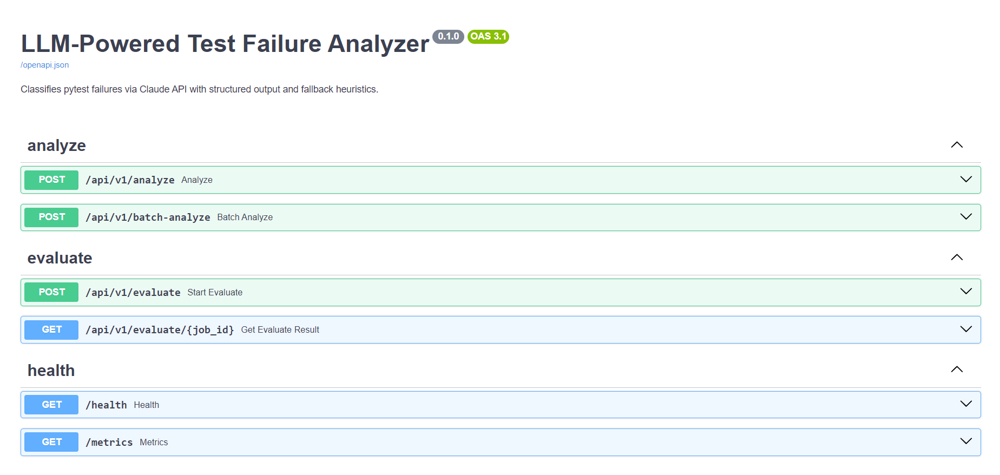
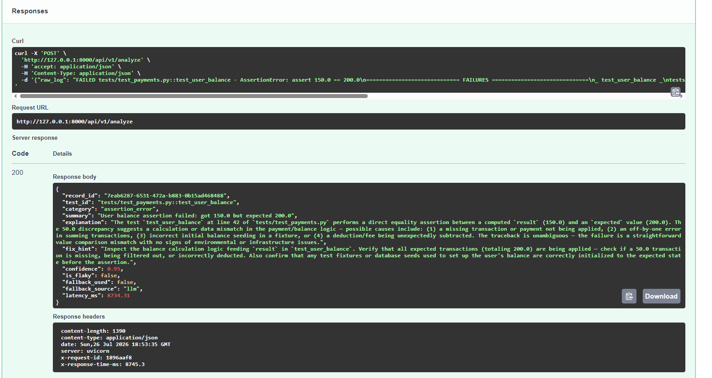
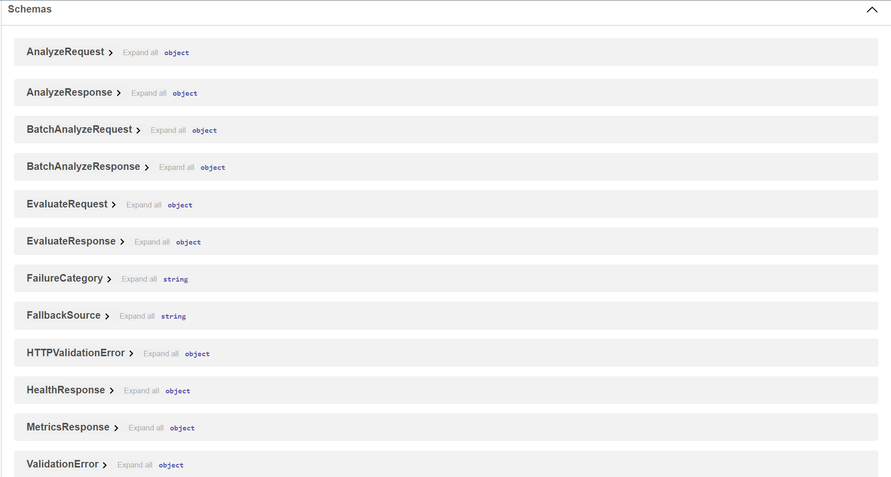
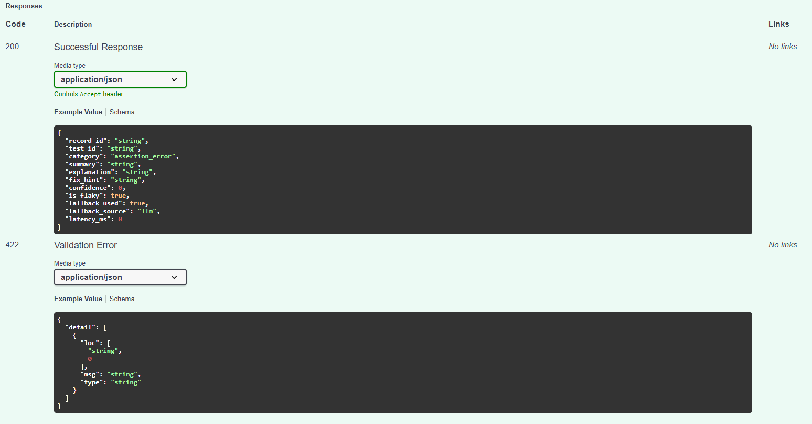
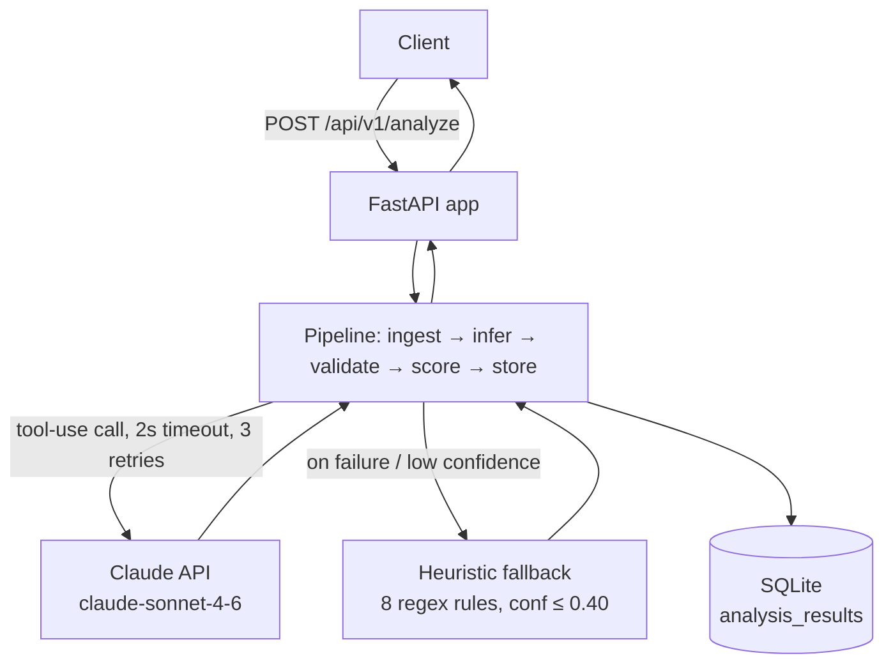
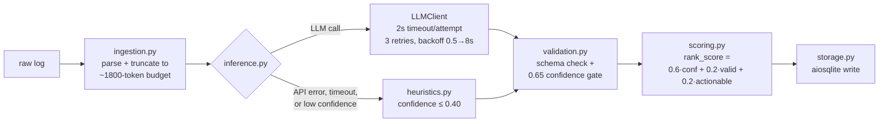

# LLM-Powered Test Failure Analyzer


## Why

CI pipelines produce failure logs faster than anyone can read them, and triaging a failing pytest run usually means a human scanning a traceback to guess whether it's a real bug, a broken fixture, a flaky test, or an environment problem. This project automates that first triage step: it ingests a raw pytest failure log, classifies the root cause using the Claude API with a schema-constrained tool call, falls back to a deterministic regex classifier if the API is unavailable or unconfident, and scores/stores the result — all behind an async FastAPI service with its own evaluation framework for measuring classification accuracy against labeled data.

## Highlights

- **Async FastAPI service** — single-log, batch (up to 50), and background-job evaluation endpoints
- **Claude tool-use structured inference** — forced `tool_choice` against a Pydantic-derived schema, so the model literally cannot return a malformed response
- **Confidence-gated deterministic fallback** — 8 regex rules covering all 9 failure categories, capped at confidence ≤ 0.40, triggered on API failure, timeout, or low-confidence LLM output
- **Evaluation framework** — 200-case labeled dataset, macro precision/recall/F1, fallback-rate and latency tracking
- **SQLite persistence** — async throughout via `aiosqlite`, zero external infra
- **CI pipeline** — ruff + mypy (strict) + pytest across Python 3.11/3.12
- **Fully typed Python** — Pydantic v2 models end-to-end from ingestion to storage

## Demo

**Swagger UI** (`/docs`) — auto-generated interactive API explorer:



**A real `POST /api/v1/analyze` call and response**, captured live from this repo running locally:



<details>
<summary>More screenshots — schemas panel & response spec</summary>




</details>

```bash
curl -X POST http://localhost:8000/api/v1/analyze \
  -H "Content-Type: application/json" \
  -d '{
    "raw_log": "FAILED tests/test_payments.py::test_user_balance - AssertionError: assert 150.0 == 200.0\n_ test_user_balance _\ntests/test_payments.py:42: in test_user_balance\n    assert result == expected\nAssertionError: assert 150.0 == 200.0\n========================= 1 failed in 0.23s ========================="
  }'
```

```json
{
  "record_id": "7eab6287-6531-472a-b883-0b15ad468488",
  "test_id": "tests/test_payments.py::test_user_balance",
  "category": "assertion_error",
  "summary": "User balance assertion failed: got 150.0 but expected 200.0",
  "explanation": "The test test_user_balance at line 42 of tests/test_payments.py performs a direct equality assertion between a computed result (150.0) and an expected value (200.0). The 50.0 discrepancy suggests a missing transaction, an off-by-one error in summing, or a stale expected value in the test.",
  "fix_hint": "Inspect the balance calculation logic feeding into result. Verify that all expected transactions (totaling 200.0) are being applied — check if a 50.0 transaction is missing, being filtered out, or incorrectly deducted.",
  "confidence": 0.95,
  "is_flaky": false,
  "fallback_used": false,
  "fallback_source": "llm",
  "latency_ms": 8734.31
}
```

This is a real, unedited response from a live `claude-sonnet-4-6` call — captured during this repo's own README verification pass, not a fabricated example.

## Table of Contents

- [Architecture](#architecture)
- [Repository Structure](#repository-structure)
- [Setup](#setup)
- [Running](#running)
- [API Endpoints](#api-endpoints)
- [Examples by Category](#examples-by-category)
- [Failure Categories](#failure-categories)
- [Evaluation](#evaluation)
- [Engineering Decisions](#engineering-decisions)
- [Design Decisions](#design-decisions)
- [Trade-offs & Limitations](#trade-offs--limitations)
- [Testing](#testing)
- [Tech Stack](#tech-stack)
- [Environment Variables](#environment-variables)

## Architecture

**System view** — request path from client to Claude and back:



**Pipeline view** — stage by stage, with real operational numbers observed in this session:



**Modules**: `ingestion.py` regex-parses the raw log into a `ParsedFailure`. `llm/client.py` wraps `AsyncAnthropic` with prompt caching, tool-use forced output, and retry/backoff. `fallback/heuristics.py` is an independent, deterministic second classifier. `pipeline/inference.py` owns the fallback-routing decision. `validation.py` and `scoring.py` gate and rank the result before `storage.py` persists it.

## Repository Structure

```
src/analyzer/
├── api/            # FastAPI app, routes (analyze, evaluate, health), middleware
├── eval/           # metrics.py (P/R/F1), runner.py (runs pipeline over labeled data)
├── fallback/       # heuristics.py — 8-rule regex classifier
├── llm/            # client.py (AsyncAnthropic wrapper), prompts.py
├── models/         # Pydantic models: pipeline, api, eval
└── pipeline/       # ingestion, inference, validation, scoring, storage
tests/              # unit/ + integration/, fully mocked LLM, no real API calls
scripts/            # seed_db.py, generate_eval_dataset.py, run_eval.py
data/eval_dataset/  # labeled_failures.json — 200 labeled cases
assets/screenshots/ # README images
```

## Setup

```bash
pip install -e ".[dev]"
cp .env.example .env        # fill in ANTHROPIC_API_KEY
python scripts/seed_db.py
```

## Running

```bash
# Start API server
uvicorn analyzer.api.app:create_app --factory --reload --port 8000

# Analyze a single failure (example)
curl -X POST http://localhost:8000/api/v1/analyze \
  -H "Content-Type: application/json" \
  -d '{"raw_log": "FAILED tests/test_foo.py::test_bar - AssertionError: assert 1 == 2"}'

# Health check
curl http://localhost:8000/health
```

## API Endpoints

| Method | Path | Description |
|--------|------|-------------|
| `POST` | `/api/v1/analyze` | Classify a single pytest log |
| `POST` | `/api/v1/batch-analyze` | Classify up to 50 logs concurrently |
| `POST` | `/api/v1/evaluate` | Start background eval job, returns `job_id` |
| `GET`  | `/api/v1/evaluate/{job_id}` | Poll eval job result |
| `GET`  | `/health` | Liveness + DB connectivity check |
| `GET`  | `/metrics` | Aggregate stats from SQLite |

## Examples by Category

Real responses from a locally running instance of this repo — not fabricated. Latency is dominated by live `claude-sonnet-4-6` generation time (see [Evaluation](#evaluation) for the honest latency picture).

<details>
<summary><b>assertion_error</b> — confidence 0.95</summary>

Request:
```json
{"raw_log": "FAILED tests/test_payments.py::test_user_balance - AssertionError: assert 150.0 == 200.0\n_ test_user_balance _\ntests/test_payments.py:42: in test_user_balance\n    assert result == expected\nAssertionError: assert 150.0 == 200.0"}
```
Response:
```json
{
  "category": "assertion_error",
  "summary": "User balance assertion failed: computed 150.0 but expected 200.0, indicating a 50.0 discrepancy in payment logic.",
  "fix_hint": "Investigate the balance calculation logic feeding into result: check for missing or double-counted transactions summing to 50.0, verify any filtering conditions, and confirm that the hardcoded expected = 200.0 in the test still reflects the intended business logic.",
  "confidence": 0.95,
  "is_flaky": false,
  "fallback_used": false,
  "latency_ms": 8800.58
}
```
</details>

<details>
<summary><b>import_error</b> — confidence 0.98</summary>

Request:
```json
{"raw_log": "FAILED tests/test_models.py::test_cache_set - ModuleNotFoundError: No module named 'redis'\n_ ERROR collecting test_models.py _\nImportError while importing test file 'tests/test_models.py'.\nModuleNotFoundError: No module named 'redis'"}
```
Response:
```json
{
  "category": "import_error",
  "summary": "ModuleNotFoundError: 'redis' package is not installed in the test environment.",
  "fix_hint": "Install the missing package by adding redis to your dependencies (pip install redis, or add it to requirements.txt / pyproject.toml). If using CI, ensure the dependency install step runs before the test step. If optional, guard the import with pytest.importorskip(\"redis\").",
  "confidence": 0.98,
  "is_flaky": false,
  "fallback_used": false,
  "latency_ms": 10032.99
}
```
</details>

<details>
<summary><b>timeout</b> — confidence 0.95</summary>

Request:
```json
{"raw_log": "FAILED tests/test_db.py::test_slow_query - TimeoutError: operation timed out after 5.0s\n_ test_slow_query _\ntests/test_db.py:88: in test_slow_query\n    result = conn.execute(query)\nTimeoutError: operation timed out after 5.0s"}
```
Response:
```json
{
  "category": "timeout",
  "summary": "Database query execution exceeded the 5.0s timeout limit in test_slow_query.",
  "fix_hint": "Investigate the query at line 88 for missing indexes, full table scans, or lock contention. If the query is expected to be slow, increase the timeout in test/connection configuration, or mock the DB call / use an in-memory SQLite DB for unit tests.",
  "confidence": 0.95,
  "is_flaky": false,
  "fallback_used": false,
  "latency_ms": 9293.23
}
```
</details>

<details>
<summary><b>flaky</b> — confidence 0.95</summary>

Request:
```json
{"raw_log": "FAILED tests/test_db.py::test_concurrent_writes - AssertionError: assert 99 == 100\n_ test_concurrent_writes _\ntests/test_db.py:120: in test_concurrent_writes\n    assert len(results) == expected_count\nAssertionError: assert 99 == 100 (known flaky: race condition in writer pool)"}
```
Response:
```json
{
  "category": "flaky",
  "summary": "Concurrent write test non-deterministically drops 1 of 100 results due to a known race condition in the writer pool.",
  "fix_hint": "Investigate the writer pool's synchronization primitives — add or strengthen locking around the shared results collection. Consider a thread-safe queue instead of a shared list, plus a barrier to ensure all writers complete before the assertion is evaluated.",
  "confidence": 0.95,
  "is_flaky": true,
  "fallback_used": false,
  "latency_ms": 8548.43
}
```
</details>

## Failure Categories

| Category | Description |
|----------|-------------|
| `assertion_error` | Value comparison failures, unexpected output |
| `import_error` | Missing modules, circular imports |
| `fixture_error` | pytest fixture setup/teardown failures |
| `timeout` | Test exceeded time limit or hung on I/O |
| `environment_error` | Missing env vars, OS-level issues |
| `network_error` | External service unreachable, SSL errors |
| `data_error` | Corrupt test data, missing fixture files |
| `flaky` | Non-deterministic failures, race conditions |
| `unknown` | Cannot be classified with confidence |

## Evaluation

The eval pipeline runs the full stack (ingestion → LLM inference → validation → scoring) over labeled cases and reports per-category precision, recall, and F1.

```bash
# Generate the dataset (one-time)
python scripts/generate_eval_dataset.py

# Quick sanity check (uses real API)
python scripts/run_eval.py --limit 25

# Full evaluation (200 cases)
python scripts/run_eval.py
```

### Real run — 25 of 200 cases, live `claude-sonnet-4-6` calls, 2026-07-26

| Metric | Value |
|---|---|
| Dataset | 25 of 200 labeled cases (dataset is shuffled, so this is a cross-category sample, not one category) |
| Accuracy | 100.0% (25/25) |
| Macro Precision | 1.000 |
| Macro Recall | 1.000 |
| Macro F1 | 1.000 |
| Avg latency | 8223 ms |
| Fallback rate | 12.0% |

**Honest caveat**: 25 cases is a small sample and perfect accuracy on it is not a claim that the model gets 100% on the full 200-case set or on real-world logs — it mainly shows the pipeline and prompt work correctly end-to-end on live traffic. The dataset itself is also synthetically templated (see [Trade-offs](#trade-offs--limitations)), which makes cases easier than messy real CI output. A full 200-case run is the natural next step but takes considerably longer and costs proportionally more in API usage.

Raw CLI output from this run:
```
============================================================
EVALUATION REPORT
============================================================
  Total cases  : 25
  Correct      : 25  (100.0%)
  Accuracy     : 1.0000
  Macro P      : 1.0000
  Macro R      : 1.0000
  Macro F1     : 1.0000
  Avg latency  : 8223ms
  Fallback rate: 12.0%

Category                    P      R     F1  Support
----------------------------------------------------
  assertion_error       1.000  1.000  1.000        8
  data_error            1.000  1.000  1.000        2
  environment_error     1.000  1.000  1.000        4
  fixture_error         1.000  1.000  1.000        1
  flaky                 1.000  1.000  1.000        2
  import_error          1.000  1.000  1.000        2
  network_error         1.000  1.000  1.000        2
  timeout               1.000  1.000  1.000        1
  unknown               1.000  1.000  1.000        3
============================================================
```

## Engineering Decisions

Every LLM prediction is confidence-gated: below-threshold or failed calls fall back to a deterministic heuristic classifier, trading some flexibility for predictable behavior under API failure or ambiguity. See [Design Decisions](#design-decisions) for the full list and [Trade-offs & Limitations](#trade-offs--limitations) for the honest downsides of each choice.

## Design Decisions

- **Schema-constrained outputs**: tool-use with `RootCauseHypothesis` input schema eliminates JSON parsing failures.
- **Confidence gating**: 0.65 threshold separates LLM from heuristic fallback; heuristic floor is 0.10–0.40.
- **No silent failures**: every error path routes to heuristic with a known confidence floor, never to an unhandled exception.
- **Async batching**: `asyncio.gather` + `Semaphore(5)` gives up to ~5× throughput on batch endpoints under concurrent load.

## Trade-offs & Limitations

**Observed live latency is higher than earlier documentation assumed, and prompt caching did not show measurable hits in this session's testing.**
Every live call made while preparing this README (single-request tests and the 25-case eval run) landed in the 7.6–10s range, and `/metrics`' `cache_hit_rate` (now genuinely computed, see below) read `0.0` across 11 real requests. The likely cause: Anthropic's prompt caching requires the cached block to meet a minimum token threshold (1024+ tokens for Sonnet-class models), and the frozen `SYSTEM_PROMPT` here is roughly 300–400 tokens — likely too small to be cache-eligible at all, regardless of the `cache_control: {type: "ephemeral"}` annotation. This is a hypothesis based on the observed 0% hit rate, not something independently confirmed against Anthropic's docs during this session — worth verifying directly (e.g. by inspecting `cache_creation_input_tokens` on a raw response) before relying on the caching architecture for cost/latency savings in practice.

**LLM latency is variable and can be high.**
The 2s default timeout in `.env.example` is intentionally aggressive for production — raise `LLM_TIMEOUT_MS` to 10000–15000 if single calls are consistently landing near 8-10s, as observed above. 3 retries × 2s = 6s worst-case before heuristic fallback kicks in from timeouts alone; real-world latency variance may exceed that budget.

**Heuristic fallback sacrifices accuracy for reliability.**
The 8 regex rules always return `confidence ≤ 0.40` and cover only the obvious patterns. A `ModuleNotFoundError` buried inside a wrapped exception won't match. This is intentional — a low-confidence answer is always better than an unhandled exception — but it means some real-world failures will get a coarse classification.

**The confidence threshold (0.65) is a fixed heuristic, not learned.**
The cutoff between "trust the LLM" and "fall back to heuristics" was chosen empirically. It has not been calibrated against a held-out validation set. A project with more labeled data should tune this with a proper precision-recall curve.

**SQLite limits horizontal scalability.**
`aiosqlite` is single-writer. Concurrent writes from multiple uvicorn workers will serialize. For multi-worker deployments, swap the storage layer for PostgreSQL (the `store_result` interface is the only surface that needs to change).

**The eval job store is in-memory.**
`routes/evaluate.py` uses a plain Python dict (`_jobs`) to track background eval jobs. Restarting the server loses all job state. Acceptable for a dev/eval tool; not acceptable in production. A Redis-backed job queue (Celery, ARQ) would be the next step.

**The eval dataset is programmatically generated, not hand-labeled.**
`data/eval_dataset/labeled_failures.json` was produced by `scripts/generate_eval_dataset.py` from templates, not from real CI failures. This makes eval scores optimistic — the 100% accuracy on the 25-case real run above should be read in that light. Real pytest output is messier (wrapped exceptions, multi-cause failures, framework noise). The generator is the right starting point; replacing it with real labeled failures is the highest-value improvement.

**`StoredRecord.db_path` uses a private aiosqlite API.**
Extracting the database path requires reading a closure variable from `db._connector`. This is fragile across aiosqlite versions and will silently return `""` if the internal layout changes. A cleaner solution would pass `db_path` explicitly at construction time.

## Testing

No test makes a real API call. Unit tests mock `LLMClient` with `AsyncMock`; integration tests mock the LLMClient directly.

```bash
# Run all tests
pytest tests/unit/ tests/integration/ -v

# With coverage
pytest tests/ -v --cov=src/analyzer --cov-report=html
```

## Tech Stack

Python 3.11+, `anthropic` SDK, FastAPI, Pydantic v2, aiosqlite, pytest, respx, ruff, mypy

## Environment Variables

See `.env.example` for all variables and defaults. Required: `ANTHROPIC_API_KEY`.

## License

MIT — see [LICENSE](LICENSE).
